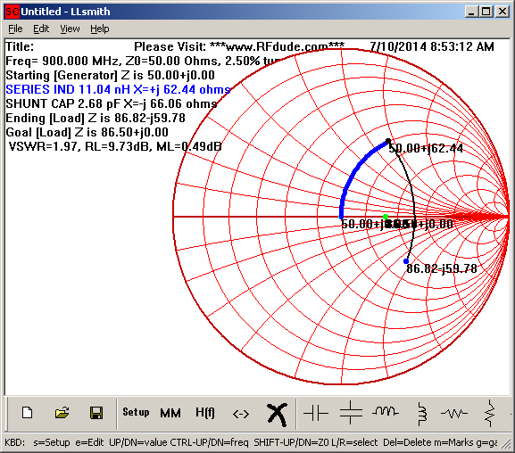
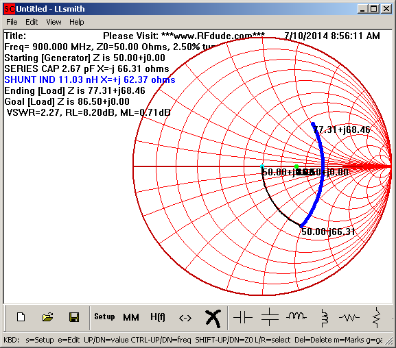

Sometimes, when working with RF, there will come a situation where one device
being used has a balanced input or output but the device which it needs to
electrically connect to has a singled-ended or unbalanced input or output.
Often these devices will also have different impedances.  In these situations,
you need to construct a balun (balanced to unbalanced) circuit to bridge these
two types of RF terminals together.

Balanced RF ports usually are designed to drive or be driven by something like a
dipole antenna.  Unbalanced RF ports usually are designed to drive or be driven
by something like a typical 50 ohm coax cable or a monopole antenna.  Attempting
to directly connect a balanced RF port to an unbalanced one, even if the
impedances match, will result in poor RF performance.

Usually baluns are made with transformers.  Most every amateur radio design book
will show how to construct a magnetic core balun for use at various frequencies
and power levels.  But in low cost consumer or similar circuit board designs, a
transformer based balun may be too expensive or too large, or simply impractical
for other reasons.

When a transformer based balun is not reasonable for the design, one option is
to create an LC balun, using only capacitors and inductors.

The goal is to take each of the balanced port pins and introduce a 90 degree
phase shift (one +90, one -90) while matching the impedance to, for example, 50
ohms, such that the unbalanced device has a proper reference.

You can see an example of a 868/915 MHz LC balun in the [datasheet for TI's
CC1101 radio][cc1101] in figure 11 on page 25:

[cc1101]: http://www.ti.com/general/docs/lit/getliterature.tsp?genericPartNumber=cc1101&fileType=pdf

A few different things are happening in the circuit between the antenna and pins
12 and 13 (RF_P and RF_N), but since the output antenna is single ended (usually
an SMA connector for coax cable or a monopole PCB antenna in most CC1101
designs), a balun is needed.  Since the CC1101 RF port has an impedance of 86.5
+ j43 ohms at 868/915 MHz, as shown in section 4.3 on page 16, the impedance
also needs to be matched to 50 ohms to match the antenna.

So what the heck is going on here?

Let's assume we want to tune this circuit for 900 MHz, that should get us close
to the ideal for covering both the 868 and 915 MHz bands.  With this assumption,
that +j43 ohms reactance of the CC1101 needs to be canceled out.  To do this,
L131 and L121 add to the inductance of the CC1101 such that a standard 1 pF
capacitor can cancel our all of the reactance.  A 1 pF cap at 900 MHz is roughly
-j176 ohms, while the pair of inductors (L131 and L121) add to about +j135 ohms.
Adding the CC1101 reactance of +j43 ohms to the +j135 ohms and subtracting the
C121's -j176 ohms nets out to about a real impedance with no reactance (it's
slightly off at 900 MHz but that's forgivable as the bands we're working with
are quite spread from each other so this is expected).  Now, looking across the
nets which span C121 into the CC1101 should look like just the real component of
the CC1101 impedance of 86.5 ohms.

At this point, now we can try to match the 86.5 ohms impedance to 50 ohms
(although this isn't what TI appears to do with their given recommended values
for this circuit).  In order to bring the net on the left side of L123 to 50
ohms, which is the simplest balun (but which may have other downsides), we first
have to calculate Rinner.  Rinner will be used to calculate the L and C values
which will apply to C131, C122, L132, and L122.  These 4 components each will
introduce a +90 and -90 degree phase shift and match the impedances, such that
we end up with a real 50 ohm singled ended (unbalanced) point on the left side
of L123.

	Rinner = sqrt(Zunbal * Zbal)

Actual calculations:

	octave:8> Rinner = sqrt(86.5 * 50)
	Rinner =  65.765

Now to calculate the L and C values using our w (which is 2 \* pi \* f):

	octave:9> w = 2 * pi * 900E6
	w =  5.6549e+09
	octave:10> L = Rinner / w
	L =  1.1630e-08
	octave:11> C = 1 / (Rinner * w)
	C =  2.6890e-12

Thus, setting C131 and C122 as 2.7 pF and setting L132 and L122 as 11 nH should
get us from the CC1101 to a single ended (unbalanced) 50 ohm match with the
proper phase shifts.

We can try this out using the [RFdude matching software][rfdude] to see the
impedance transform when looking into the 50 ohm side of the circuit:

[rfdude]:http://tools.rfdude.com/RFdude_Smith_Chart_Program/RFdude_smith_chart_program.html

As each of the resulting impedances' reactances roughly cancel each other out,
we have successfully transformed from the single ended 50 ohm impedance to the
balanced 86.5 ohm impedance.

I really don't understand TI's recommended values given in the CC1101 datasheet
for 868/915 Mhz operation.  Their match does not work for me.  However, the
given topology and values for their 433 MHz match works out fairly close when I
use RFdude to evaluate it, however why they don't cancel the reactance of the
CC1101 in the 315/433 MHz topology is a mystery to me, since they do cancel it
in the 868/915 MHz topology.

When going from a low impedance balanced port to a higher impedance single ended
unbalanced port, a few small changes need to be made.  The same calculations can
be used to determine the L and C values but the topology changes, somewhat.
Instead of having a series inductor and shunt cap, a shunt inductor and series
cap is used.  This moves the transform from 50 ohms to a lower impedance,
like:

Atmel actually have a nice [application note][atmel] on this and their values
actually do work out, which is nice.

[atmel]:http://www.atmel.com/Images/doc8113.pdf

